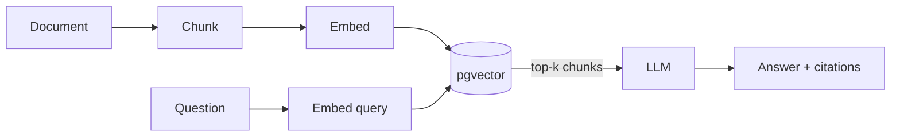

# Laravel pgvector RAG Starter

> Add semantic search and Retrieval-Augmented Generation (RAG) to any Laravel app with PostgreSQL + pgvector.

Ingest documents → they are chunked, embedded and stored in pgvector → ask questions and get answers grounded **only** in your own documents, with source citations.

This repository is a runnable Laravel 13 + Vue 3 (Inertia) application that demonstrates the reusable [`rubyat/laravel-rag`](packages/laravel-rag) package living under `packages/`.

## Features

- 🧩 **Document ingestion** — text is chunked (configurable size/overlap), embedded and stored.
- 🔎 **pgvector vector search** — cosine similarity over an HNSW index for high recall at any scale.
- 💬 **RAG pipeline** — retrieves the most relevant chunks and asks an LLM to answer from them.
- 🔌 **Driver-based** — swap embedding/chat providers (OpenAI built-in; `fake` drivers for offline dev/tests).
- 📎 **Source citations** — every answer returns the chunks it was grounded in, with similarity scores.
- ⚙️ **Sync or queued ingestion** — inline by default, or dispatch a job for large documents.
- 🖥️ **Vue chat demo** — an authenticated `/rag` page to ingest and ask in the browser.
- ✅ **Tested** — Pest unit + feature tests, green on GitHub Actions with a pgvector service.

## Architecture

```
            ingest                                    ask
              │                                         │
              ▼                                         ▼
      ┌───────────────┐                        ┌────────────────┐
      │ DocumentChunker│                        │ VectorRetriever│
      └───────┬───────┘                        └───────┬────────┘
              │ chunks                                  │ query embedding
              ▼                                         ▼
      ┌───────────────┐    embeddings          ┌────────────────┐
      │ EmbeddingDriver│ ─────────────┐         │   pgvector      │
      └───────────────┘              ▼         │  (cosine, HNSW) │
                              ┌────────────┐    └───────┬────────┘
                              │  pgvector  │            │ top-k chunks
                              │  documents │            ▼
                              └────────────┘    ┌────────────────┐
                                                │  RagPipeline    │
                                                │ context + LLM   │
                                                └───────┬────────┘
                                                        ▼
                                              answer + citations
```



## Requirements

- PHP 8.3+
- PostgreSQL with the [`pgvector`](https://github.com/pgvector/pgvector) extension (0.5+; HNSW needs 0.5+)
- Node 20+ / npm

## Installation

```bash
# 1. Install dependencies
composer install
npm install

# 2. Environment
cp .env.example .env
php artisan key:generate

# 3. Point DB_URL at a PostgreSQL database with pgvector available, e.g.
#    DB_CONNECTION=pgsql
#    DB_URL="postgresql://user@localhost:5432/laravel-pgvector-rag"

# 4. Migrate (creates the documents table + vector column + HNSW index)
php artisan migrate

# 5. Configure an embedding/chat provider (or keep the offline fakes)
#    OPENAI_API_KEY=sk-...
#    RAG_EMBEDDING_DRIVER=openai
#    RAG_CHAT_DRIVER=openai

# 6. Run it
composer dev
```

> The migration runs `CREATE EXTENSION IF NOT EXISTS vector`, which requires a database role allowed to create extensions. If you don't have pgvector, the [pgvector Docker image](https://hub.docker.com/r/pgvector/pgvector) (`pgvector/pgvector:pg16`) is the quickest way to get it.

## Usage

### HTTP API

Ingest a document:

```bash
curl -X POST http://localhost:8000/api/rag/ingest \
  -H "Content-Type: application/json" \
  -d '{"source": "handbook.md", "content": "Postgres pgvector stores embeddings and supports cosine similarity search..."}'
# => 201 { "message": "Document ingested.", "source": "handbook.md", "chunks": 1 }
```

Ask a question:

```bash
curl -X POST http://localhost:8000/api/rag/ask \
  -H "Content-Type: application/json" \
  -d '{"question": "How does pgvector search work?", "top_k": 4}'
# => 200
# {
#   "answer": "pgvector stores embeddings and supports cosine similarity search...",
#   "citations": [
#     { "source": "handbook.md", "chunk_index": 0, "content": "...", "score": 0.83 }
#   ]
# }
```

### Vue chat page

Log in and open `/rag` to ingest documents and ask questions in the browser. Answers render with their source citations and similarity scores.

### In code

```php
use RagStarter\Ingestion\DocumentIngestor;
use RagStarter\Rag\RagPipeline;

app(DocumentIngestor::class)->ingest('handbook.md', $longText);

$result = app(RagPipeline::class)->ask('How does pgvector search work?');
// ['answer' => '...', 'citations' => [...]]
```

## Configuration

Published to `config/rag.php` (`php artisan vendor:publish --tag=rag-config`). Key options:

| Option | Env | Default | Description |
| --- | --- | --- | --- |
| `embedding_driver` | `RAG_EMBEDDING_DRIVER` | `openai` | `openai` or `fake` |
| `chat_driver` | `RAG_CHAT_DRIVER` | `openai` | `openai` or `fake` |
| `dimensions` | `RAG_DIMENSIONS` | `1536` | Vector size; must match the embedding model |
| `chunk_size` | `RAG_CHUNK_SIZE` | `1000` | Chunk length in characters |
| `chunk_overlap` | `RAG_CHUNK_OVERLAP` | `200` | Overlap between chunks |
| `top_k` | `RAG_TOP_K` | `4` | Chunks retrieved per question |
| `queue_ingestion` | `RAG_QUEUE_INGESTION` | `false` | Dispatch ingestion to the queue (needs a worker) |
| `route_prefix` | `RAG_ROUTE_PREFIX` | `api/rag` | Prefix for the package routes |

The `fake` drivers are deterministic and need no network access — they power the test suite and let you try the flow without API keys.

## Testing

Tests run against PostgreSQL + pgvector (configured in `phpunit.xml`) with the `fake` drivers, so no API keys or network are needed.

```bash
php artisan test                 # full suite
php artisan test --filter=Rag    # just the RAG tests
./vendor/bin/pest tests/Unit     # unit tests only
```

## Roadmap

- Additional embedding/chat drivers (Ollama, Anthropic).
- Reranking of retrieved chunks.
- Metadata filtering on retrieval.
- Streaming answers.

## License

MIT.
